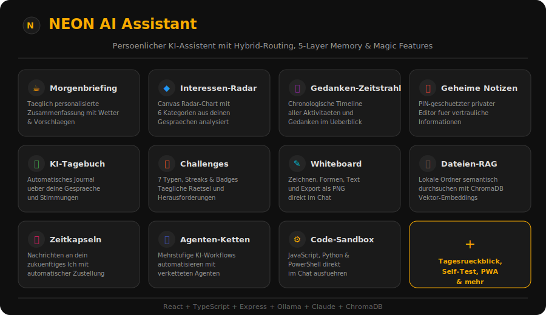
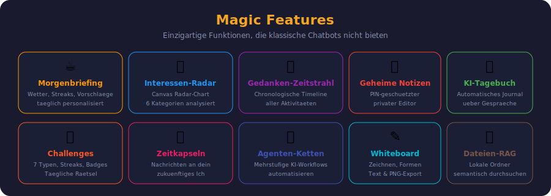
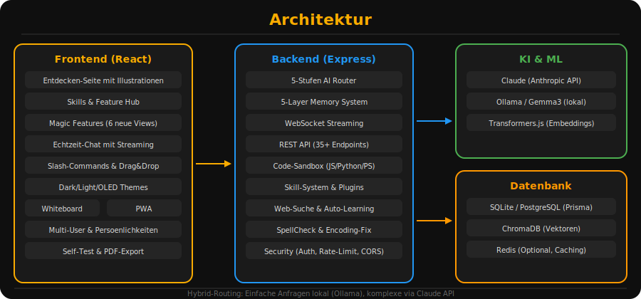

# NEON AI Assistant

> Persoenlicher KI-Assistent mit Hybrid-Routing (Claude + Ollama), 5-Layer Memory System, Magic Features und Entdecken-Seite


NEON ist ein vollstaendiger KI-Assistent als Web-App, der Claude AI und lokale LLMs (Ollama/Gemma3) kombiniert. Das System routet Anfragen intelligent zwischen Cloud und lokal, merkt sich Kontext ueber ein 5-schichtiges Gedaechtnissystem und bietet einzigartige Magic Features, die ueber einen normalen Chatbot hinausgehen.

---

## Uebersicht



---

## Features

### Kern-Features

- **Hybrid AI Router** — 5-Stufen-Orchestrator routet automatisch zwischen Claude (komplex) und Ollama (schnell/privat)
- **5-Layer Memory** — Working, Short-Term, Long-Term, Episodic, Semantic mit Importance Scoring, Decay und Consolidation
- **Semantische Suche** — Vektor-basierte Suche ueber alle Konversationen (Ctrl+K)
- **Netzwerk-Zugriff** — Erreichbar von jedem Geraet im LAN (PC, Handy, Tablet)
- **Echtzeit-Streaming** — Token-fuer-Token Antworten via WebSocket
- **Lernmodus** — Interview-Sessions zur Persoenlichkeitsentwicklung
- **Web-Suche** — DuckDuckGo + Wikipedia Integration
- **Wetter** — OpenWeatherMap Integration
- **Wissensbasis (RAG)** — Dokumente importieren und per KI durchsuchen
- **Emotion Tracking** — Stimmungserkennung in Gespraechen
- **Admin Panel** — Memory-Management, Extraktion, API-Kosten-Tracking, Performance-Dashboard
- **Code-Ausfuehrung** — JavaScript, Python, PowerShell in einer Sandbox

### Magic Features



Einzigartige Funktionen, die klassische Chatbots nicht bieten:

| Feature | Beschreibung |
|---------|-------------|
| **Morgenbriefing** | Taeglich personalisierte Zusammenfassung mit Wetter, Streaks und Vorschlaegen |
| **Interessen-Radar** | Canvas-basiertes Radar-Chart zur Visualisierung deiner Interessen in 6 Kategorien |
| **Gedanken-Zeitstrahl** | Chronologische Timeline deiner Gespraeche, Erinnerungen und Recherchen |
| **Geheime Notizen** | PIN-geschuetzter privater Notiz-Editor mit Verschluesselung |
| **KI-Tagebuch** | NEON schreibt automatisch ein Journal ueber eure Gespraeche |
| **Challenges** | 7 Challenge-Typen (Denk-Raetsel, Quiz, Code, Kreativ, Debatte, Kopfrechnen, Wort-Akrobat) mit Streaks und Badges |
| **Zeitkapseln** | Nachrichten an dein zukuenftiges Ich planen und automatisch oeffnen |
| **Agenten-Ketten** | Mehrstufige KI-Workflows: Recherche → Zusammenfassung → Gedaechtnis |
| **Whiteboard** | Zeichnen, Formen, Text mit Undo/Redo und PNG-Export |
| **Dateien-RAG** | Lokale Ordner indexieren und semantisch durchsuchen |
| **Tagesrueckblick** | Automatische Zusammenfassung: Gespraeche, Recherchen, Zeitkapseln des Tages |
| **Erklaer-Stufen** | Jede Antwort auf 5 Niveaus erklaeren lassen: Kind bis Experte |

### Entdecken-Seite

Eine interaktive Uebersichtsseite (wie bei Microsoft Copilot) mit:

- **Hero-Banner** mit animierten SVG-Illustrationen
- **Schnellstart-Buttons** fuer haeufige Aktionen
- **Prompt-Vorschlaege** nach Kategorien (Lernen, Programmieren, Kreativ, Produktivitaet, Analyse, Recherche, Alltag)
- **Feature-Karten** mit SVG-Illustrationen fuer alle 12 Magic Features

### Weitere Features (v2)

| Feature | Beschreibung |
|---------|-------------|
| **Slash-Commands** | `/wetter`, `/suche`, `/code`, `/kapsel`, `/recherche`, `/memory`, `/hilfe` |
| **Konversations-Export** | Markdown + Text Export |
| **Themes** | Dark, Light, OLED mit visueller Vorschau |
| **Drag & Drop** | Bilder, PDFs, Textdateien in den Chat ziehen |
| **Multi-User** | Profile mit Avataren, separates Gedaechtnis |
| **Persoenlichkeiten** | Sachlich, Freundlich, Sarkastisch, Lehrer, Pirat |
| **Konversations-Fork** | Ab jeder Nachricht verzweigen |
| **PWA** | Installierbar als App mit Push-Notifications und Offline-Support |
| **Skills & Feature Hub** | Zentraler Ort fuer alle erweiterten Funktionen mit Kategorie-Filter |

---

## Architektur



---

## Schnellstart

### Voraussetzungen

- [Node.js 20+](https://nodejs.org/)
- [Ollama](https://ollama.com/download) (fuer lokale KI)
- Optional: [Docker Desktop](https://www.docker.com/products/docker-desktop/) (fuer PostgreSQL/Redis/ChromaDB)

### Installation

```bash
# 1. Repository klonen
git clone https://github.com/Downloader4k/neon-ai-assistant.git
cd neon-ai-assistant

# 2. Dependencies installieren
npm install

# 3. Backend konfigurieren
cp backend/.env.example backend/.env
# -> ANTHROPIC_API_KEY eintragen

# 4. Datenbank initialisieren
cd backend
npx prisma generate
npx prisma migrate deploy
cd ..

# 5. Ollama Modell laden
ollama pull gemma3:4b
# Oder fuer bessere Qualitaet (braucht 12GB VRAM):
# ollama pull gemma3:12b

# 6. Starten
npm run dev
```

### Zugriff

```
Lokal:     http://localhost:5173
Netzwerk:  http://<deine-ip>:5173   (von jedem Geraet im LAN)
Backend:   http://localhost:3001
```

---

## Tech Stack

### Frontend (Browser)
React 18 | TypeScript | Vite | Tailwind CSS | Zustand | Socket.io | Framer Motion

### Backend
Node.js | Express | TypeScript | Prisma | Socket.io | Winston

### KI & ML
Claude (Anthropic SDK) | Ollama/Gemma3 | Transformers.js (Embeddings) | ChromaDB (Vektoren)

### Infrastruktur
SQLite (Default) | PostgreSQL (Optional) | Redis (Optional) | Docker Compose

---

## Projektstruktur

```
neon-ai-assistant/
├── backend/                # Express.js Server (Port 3001)
│   ├── src/
│   │   ├── api/            # REST Routes + WebSocket
│   │   ├── services/       # 35+ Business Logic Services
│   │   │   ├── router/     # AI Routing (5-Stage Orchestrator)
│   │   │   ├── memory/     # 5-Layer Memory System
│   │   │   ├── search/     # Semantische Suche (ChromaDB)
│   │   │   ├── claude/     # Claude API
│   │   │   ├── ollama/     # Ollama Integration
│   │   │   └── ...
│   │   └── utils/
│   └── prisma/             # Datenbank-Schema
│
├── frontend/               # React Web-App (Vite)
│   ├── src/
│   │   ├── components/     # 40+ UI Komponenten
│   │   │   ├── DiscoverPage.tsx     # Entdecken-Seite
│   │   │   ├── SkillStore.tsx       # Skills & Feature Hub
│   │   │   ├── MorningBriefing.tsx  # Morgenbriefing
│   │   │   ├── PersonalityRadar.tsx # Interessen-Radar
│   │   │   ├── ThoughtTimeline.tsx  # Gedanken-Zeitstrahl
│   │   │   ├── SecretNotes.tsx      # Geheime Notizen
│   │   │   ├── AIDiary.tsx          # KI-Tagebuch
│   │   │   ├── ChallengeMode.tsx    # Challenges
│   │   │   └── ...
│   │   ├── store/          # Zustand State Management
│   │   ├── services/       # STT, TTS
│   │   └── styles/
│   └── vite.config.ts
│
├── shared/types/           # Geteilte TypeScript-Typen
├── docker/                 # Docker Compose (PostgreSQL, Redis, ChromaDB)
├── docs/                   # Dokumentation & Screenshots
├── scripts/                # Wartungs-Skripte
└── KONZEPT_V2.md           # Detailliertes Konzeptdokument
```

---

## Memory System

| Schicht | Lebensdauer | Zweck |
|---------|-------------|-------|
| **Working** | 1-4 Stunden | Aktive Session |
| **Short-Term** | 1-7 Tage | Kuerzliche Infos |
| **Long-Term** | Permanent | Wichtige Fakten |
| **Episodic** | Variabel | Ereignisse |
| **Semantic** | Permanent | Strukturiertes Wissen |

Automatische Consolidation, Importance Scoring, Memory Decay und Promotion.

---

## AI Router

5-Stufen Entscheidungsprozess:

1. **Domain-Klassifikation** — Emotional? → Ollama. Komplex? → weiter
2. **Komplexitaetsbewertung** — Score < 70? → Ollama
3. **Self-Confidence** — Ollama sicher genug? → Ollama
4. **Depth Threshold** — Tiefe noetig? → Claude
5. **Execution** — Antwort streamen

Konfigurierbar via `.env`:
```env
ENABLE_ORCHESTRATOR=true
CLAUDE_THRESHOLD=0.85
COMPLEXITY_THRESHOLD=70
```

---

## Konfiguration

### Backend (.env)

```env
# Server
PORT=3001
HOST=0.0.0.0

# KI
ANTHROPIC_API_KEY=sk-ant-api03-...
OLLAMA_BASE_URL=http://localhost:11434
OLLAMA_MODEL=gemma3:4b

# Datenbank
DATABASE_URL="file:./prisma/neon.db"

# Router
ENABLE_ORCHESTRATOR=true
CLAUDE_THRESHOLD=0.85
```

---

## Entwicklung

```bash
# Alles starten (Backend + Frontend parallel)
npm run dev

# Nur Backend
npm run dev:backend

# Nur Frontend
npm run dev:frontend

# Build (Production)
npm run build

# Datenbank
cd backend
npx prisma studio       # Visual DB Browser
npx prisma migrate dev  # Neue Migration
```

---

## API

### REST (Auszug)

```
GET  /api/health                    # System-Status
GET  /api/search?q=query            # Semantische Suche
GET  /api/memory/:userId            # Erinnerungen
POST /api/memory/:userId/retrieve   # Relevante Memories
POST /api/code/execute               # Code ausfuehren (JS/Python/PS)
GET  /api/admin/stats               # System-Statistiken
GET  /api/admin/usage               # API-Kosten
GET  /api/admin/performance          # Performance-Metriken
POST /api/magic/capsules             # Zeitkapsel erstellen
GET  /api/magic/capsules/:userId     # Zeitkapseln abrufen
GET  /api/summary/daily              # Tages-Zusammenfassung
POST /api/rag/index                  # Ordner indexieren (RAG)
GET  /api/rag/search?q=query         # RAG-Suche
GET  /api/rag/status                 # RAG-Status
```

### WebSocket

```typescript
// Nachricht senden
socket.emit('user-message', { message, conversationId, userId })

// Streaming-Antwort empfangen
socket.on('ai-response-chunk', ({ chunk, provider }))
socket.on('ai-response-complete', ({ conversationId }))
```

---

## Status der Phasen

### Alle Phasen abgeschlossen

| Phase | Feature | Status |
|-------|---------|--------|
| 0-4 | Infrastruktur, Chat, Datenbank, AI-Integration | Fertig |
| 5 | Semantische Suche (ChromaDB + Embeddings) | Fertig |
| 6 | 5-Layer Memory System (Consolidation, Decay, Scoring) | Fertig |
| 7 | Admin Panel (Memory-Management, Extraktion, API-Kosten, Performance) | Fertig |
| 8 | Voice I/O (Browser Web Speech API: STT + TTS) | Fertig |
| 9 | Proaktive KI (Kontext-Monitoring, Vorschlaege) | Fertig |
| 10 | Lernmodus (Interview-Sessions, Persoenlichkeit) | Fertig |
| 11 | Settings (KI-Verhalten, Privacy, Appearance) | Fertig |
| 12 | Code-Tools (JS/Python/PowerShell Sandbox + UI) | Fertig |
| 13 | Plugin-System (Skill-Store, dynamisches Loading) | Fertig |
| 14 | Web-Suche & Skills (DuckDuckGo + Wikipedia + Wetter + Auto-Learning) | Fertig |
| 15 | Performance (Dashboard, MemoryMonitor, PerformanceMonitor) | Fertig |
| 16 | Security (Token-Auth, Rate-Limiting, XSS, Helmet, CORS) | Fertig |
| 17 | Magic Features (Emotion Tracking, Zeitkapseln, Predictive Assistant) | Fertig |
| 18 | Magic Features v2 (Morgenbriefing, Radar, Timeline, Notizen, Tagebuch, Challenges) | Fertig |
| 19 | Entdecken-Seite & Feature Hub (SVG-Illustrationen, Prompt-Vorschlaege) | Fertig |

### Naechste Schritte

- Responsive Design (Mobile-Optimierung)
- Multi-Modell-Routing (Code-Modell + Chat-Modell)
- CI/CD Pipeline (GitHub Actions)
- Unit Tests fuer Kern-Services
- Whisper STT Integration (Backend)

---

## Dokumentation

- [KONZEPT_V2.md](./KONZEPT_V2.md) — Vollstaendiges Konzept mit Architektur, Audit und Roadmap
- [SETUP.md](./SETUP.md) — Detaillierte Setup-Anleitung
- [AGENT_RULES.md](./AGENT_RULES.md) — Verhaltensregeln des Assistenten

---

## Lizenz

MIT

---

Gebaut von Downloader4k mit Claude AI.
