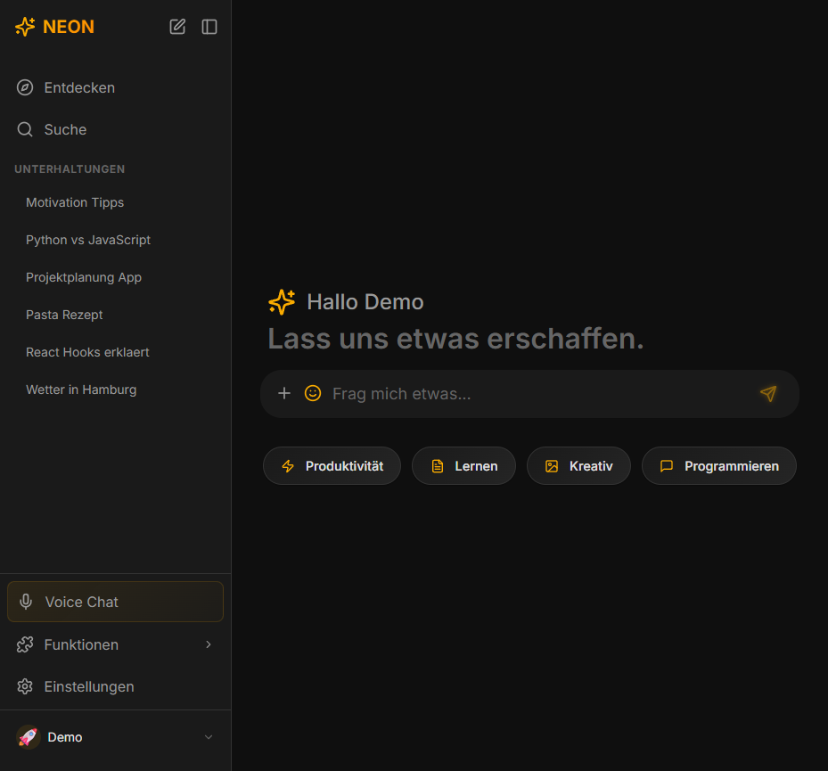
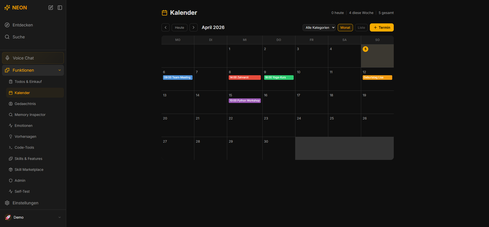
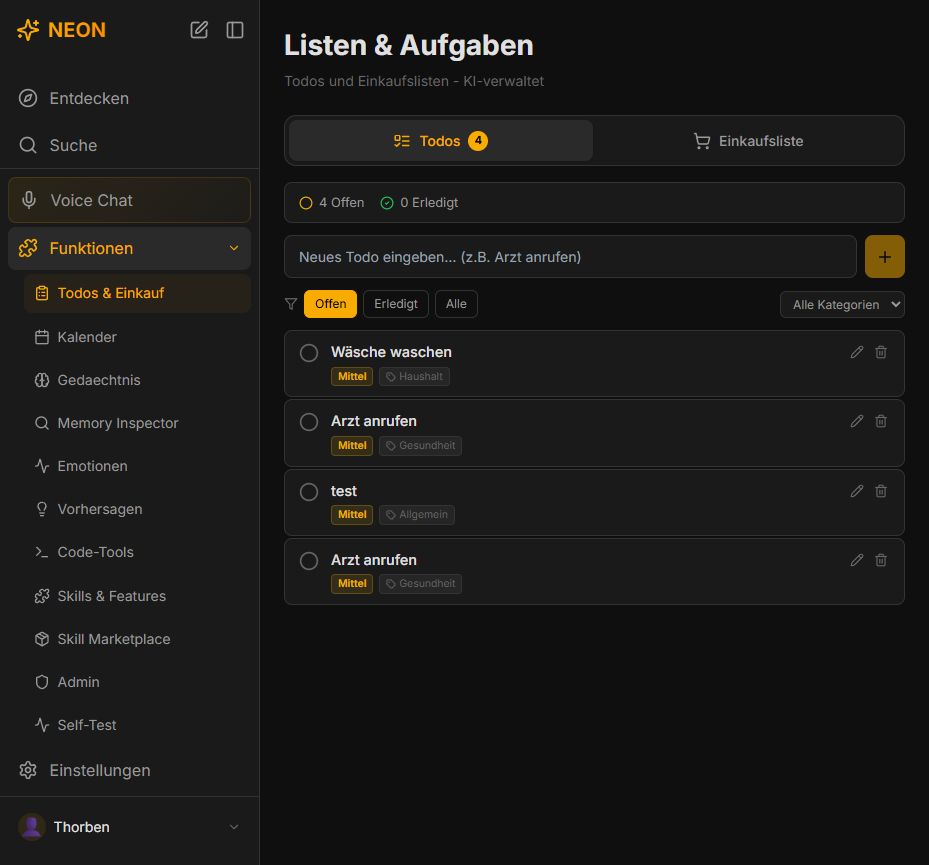

# NEON AI Assistant

> Persoenlicher Hybrid-KI-Assistent mit 5-Schichten-Gedaechtnis, intelligentem Modell-Routing (Claude + Ollama), Sprachein-/ausgabe, Todo-/Einkaufs-/Kalenderverwaltung und 30+ Features


NEON ist ein vollstaendiger KI-Assistent als Web-App, der Claude AI und lokale LLMs (Ollama/Gemma3) kombiniert. Das System routet Anfragen intelligent zwischen Cloud und lokal, merkt sich Kontext ueber ein 5-schichtiges Gedaechtnissystem und bietet zahlreiche Funktionen, die ueber einen normalen Chatbot hinausgehen.

### Screenshots

| Chat | Kalender | Todos & Einkauf |
|:---:|:---:|:---:|
|  |  |  |

---

## Warum NEON?

| | Typische Chat-Apps | NEON |
|---|---|---|
| **KI-Modell** | Ein Anbieter (Cloud) | Hybrid: Claude (komplex) + Ollama (schnell/privat) |
| **Gedaechtnis** | Nur Chat-Verlauf | 5-Schichten-Memory mit Decay, Konsolidierung und Promotion |
| **Alltag** | Nur Chat | Todos, Einkaufslisten, Kalender, Wetter — alles per Chat oder UI |
| **Privatspheare** | Alles in der Cloud | Lokale LLMs fuer private Anfragen, SQLite auf deinem Rechner |
| **Erweiterbar** | Geschlossenes System | Skill Marketplace, Agenten-Ketten, Code-Ausfuehrung |
| **Zugriff** | Nur ein Geraet | Web-App im LAN von jedem Geraet erreichbar |

---

## Schnellstart

### Voraussetzungen

- [Node.js 20+](https://nodejs.org/)
- [Anthropic API Key](https://console.anthropic.com/) (fuer Claude)
- Optional: [Ollama](https://ollama.com/download) (fuer lokale KI)
- Optional: Python 3.10+ (fuer faster-whisper STT)

### Installation

```bash
# Repository klonen
git clone https://github.com/Downloader4k/neon-ai-assistant.git
cd neon-ai-assistant

# Dependencies installieren
npm install

# Backend konfigurieren
cp backend/.env.example backend/.env
# -> ANTHROPIC_API_KEY eintragen

# Datenbank initialisieren
npm run prisma:generate
npm run prisma:migrate

# Starten (Backend + Frontend parallel)
npm run dev
```

### Zugriff

```
Lokal:     http://localhost:5173
Netzwerk:  http://<deine-ip>:5173   (jedes Geraet im LAN)
Backend:   http://localhost:3001
```

### Optional: Ollama (lokale KI)

```bash
ollama pull gemma3:12b   # oder gemma3:4b fuer weniger VRAM
```

### Optional: Spracherkennung (STT)

```bash
pip install faster-whisper
```

---

## Features

### Kern-Funktionen

- **Hybrid AI Router** — 5-Stufen-Orchestrator routet zwischen Claude (komplex) und Ollama (schnell/privat)
- **5-Schichten-Gedaechtnis** — Working, Short-Term, Long-Term, Episodic, Semantic mit Decay und Konsolidierung
- **Echtzeit-Streaming** — Token-fuer-Token Antworten via WebSocket
- **Semantische Suche** — Vektorbasierte Suche ueber alle Konversationen (Ctrl+K)
- **Multi-User** — Separate Profile mit eigenen Konversationen und Einstellungen
- **Datei-RAG** — Dokumente importieren (PDF, TXT, MD) und per KI durchsuchen
- **Code-Ausfuehrung** — JavaScript, Python, PowerShell in Sandbox
- **Web-Integration** — DuckDuckGo, Wikipedia, OpenWeatherMap
- **Netzwerk-Zugriff** — Erreichbar von jedem Geraet im LAN

### Slash-Commands

Im Chat `/` tippen um alle Commands zu sehen:

| Command | Beschreibung |
|---------|-------------|
| `/todo [aufgabe]` | Neues Todo erstellen (KI kategorisiert automatisch) |
| `/todos` | Alle offenen Todos anzeigen |
| `/einkauf [artikel, ...]` | Artikel zur Einkaufsliste hinzufuegen |
| `/einkaufsliste` | Einkaufsliste anzeigen |
| `/termin [beschreibung]` | Neuen Termin erstellen (KI kategorisiert automatisch) |
| `/termine` | Naechste Termine anzeigen |
| `/kalender` | Kalender oeffnen |
| `/listen` | Listen-Manager oeffnen |
| `/wetter [stadt]` | Wetterbericht abrufen |
| `/suche [query]` | Semantische Suche oeffnen |
| `/code [sprache]` | Code-Tools oeffnen |
| `/recherche [thema]` | Web-Recherche starten |
| `/memory [query]` | Gedaechtnis durchsuchen |
| `/kapsel [nachricht]` | Zeitkapsel erstellen |
| `/hilfe` | Alle Commands anzeigen |

### Todos & Einkaufslisten

- **Chat-Steuerung**: `/todo Arzt anrufen` erstellt ein Todo mit automatischer Kategorie (Arbeit, Haushalt, Gesundheit, ...) und Prioritaet
- **Einkauf per Chat**: `/einkauf 2x Milch, Brot, 500g Mehl` fuegt Artikel hinzu, erkennt Mengen, Kategorien und Laeden
- **UI-Panel**: Dedizierter Listen-Manager unter Funktionen > Todos & Einkauf
- **Sub-Commands**: `/todo done Arzt` (erledigen), `/einkauf done Milch` (gekauft), `/einkauf clear` (gekaufte entfernen)

### Kalender / Terminkalender

- **Chat-Steuerung**: `/termin Zahnarzt am Freitag um 10 Uhr` erstellt einen Termin mit automatischer Kategorie und Farbe
- **Natuerliche Sprache**: "Ich habe einen Arzttermin morgen um 14 Uhr", "Was habe ich heute vor?", "Zeig mir meine Termine"
- **Datum/Zeit-Erkennung**: Versteht "heute", "morgen", Wochentage, "am 5. April", "14 Uhr", "halb 3"
- **Auto-Kategorisierung**: Arbeit (blau), Gesundheit (rot), Sport (gruen), Feier (orange), Bildung (lila), Freizeit (pink), etc.
- **UI-Seite**: Monatsansicht mit Kalender-Grid + Listenansicht unter Funktionen > Kalender
- **CRUD**: Termine erstellen, bearbeiten (Inline-Edit), loeschen, filtern nach Kategorie

### Voice / Sprache

- **Voice Chat Popup** — Walkie-Talkie-Modus: Mikrofon druecken, sprechen, nochmal druecken zum Senden
- **Text-to-Speech** — 30+ Neural Voices via Microsoft Edge TTS
- **Stimmenauswahl** — Vorhoeren und Wechseln direkt im Chat oder Voice-Popup
- **Auto-Vorlesen** — KI-Antworten werden automatisch vorgelesen (umschaltbar)
- **Speech-to-Text** — faster-whisper (lokal) oder Web Speech API (Browser-Fallback)

### Weitere Funktionen

| Feature | Beschreibung |
|---------|-------------|
| **Entdecken-Seite** | Startseite mit Quick-Start-Prompts und Feature-Karten |
| **Persoenlichkeiten** | 5 Modi: Freundlich, Sachlich, Sarkastisch, Lehrer, Pirat |
| **Morgenbriefing** | Tagesstart mit Wetter, Zusammenfassung und Vorschlaegen *(vorerst deaktiviert)* |
| **Challenge Mode** | Raetsel, Quiz, Code-Challenges, Debatten, Kreativ-Aufgaben |
| **Thought Timeline** | Chronologische Ansicht aller Konversationen |
| **AI Diary** | Automatische Tagebuch-Generierung aus Gespraechen |
| **Secret Notes** | PIN-geschuetzte verschluesselte Notizen |
| **Canvas/Whiteboard** | Zeichenflaeche mit Undo/Redo und PNG-Export |
| **Zeitkapseln** | Nachrichten an das zukuenftige Ich |
| **Emotionstracking** | Sentiment-Analyse in Gespraechen |
| **Skill Marketplace** | Erweiterbare Skills und Plugins |
| **Memory Inspector** | Gedaechtnis-Visualisierung und -Verwaltung |
| **Interessen-Radar** | Canvas-basiertes Radar-Chart deiner Interessen |
| **Agenten-Ketten** | Mehrstufige KI-Workflows (Recherche, Zusammenfassung, ...) |
| **Erklaer-Stufen** | Jede Antwort auf 5 Niveaus: Kind bis Experte |
| **Tagesrueckblick** | Automatische Zusammenfassung des Tages |
| **Konversations-Fork** | Ab jeder Nachricht verzweigen |
| **Lernmodus** | Interview-Sessions zur Persoenlichkeitsentwicklung |
| **Admin Panel** | Systemueberwachung, API-Kosten, Performance-Dashboard |
| **Themes** | Dark (Standard), Light, OLED |
| **Drag & Drop** | Bilder, PDFs, Textdateien in den Chat ziehen |

---

## Tech Stack

| Bereich | Technologie |
|---------|------------|
| **Backend** | Node.js, Express, TypeScript, Socket.io, Winston |
| **Frontend** | React 18, Vite, Tailwind CSS, Zustand, Framer Motion |
| **Datenbank** | SQLite (Prisma ORM) |
| **Vektor-DB** | ChromaDB + sqlite-vec |
| **KI Cloud** | Anthropic Claude API |
| **KI Lokal** | Ollama (Gemma3, Llama, etc.) |
| **TTS** | Microsoft Edge TTS (msedge-tts) |
| **STT** | faster-whisper (Python) + Web Speech API |
| **Optional** | Redis, Docker Compose |

---

## Projektstruktur

```
neon-ai-assistant/
├── backend/
│   ├── src/
│   │   ├── api/              # REST Routes + WebSocket
│   │   ├── services/
│   │   │   ├── router/       # Hybrid AI Router (5-Stufen)
│   │   │   ├── memory/       # 5-Schichten-Gedaechtnis
│   │   │   ├── search/       # Semantische Suche
│   │   │   ├── claude/       # Claude API Service
│   │   │   ├── ollama/       # Ollama Service
│   │   │   ├── skills/       # Skill Processor + Commands
│   │   │   ├── voice/        # TTS + STT Services
│   │   │   ├── db/           # Todo, Shopping, User Services
│   │   │   ├── magic/        # Spezial-Features
│   │   │   └── web/          # Web-Suche, Scraping
│   │   ├── middleware/       # Auth, Rate Limiting
│   │   └── utils/            # Logger, Helpers
│   ├── prisma/               # Schema + Migrations
│   └── scripts/              # Whisper STT Script
├── frontend/
│   ├── src/renderer/
│   │   ├── components/       # 40+ React-Komponenten
│   │   ├── store/            # Zustand State Management
│   │   ├── services/         # Audio Services
│   │   └── App.tsx           # Haupt-App
│   └── public/               # Statische Assets
├── docs/                     # Dokumentation
└── package.json              # Workspace Root
```

---

## Memory System

| Schicht | Lebensdauer | Zweck |
|---------|-------------|-------|
| **Working** | 1-4 Stunden | Aktive Session, Kontext |
| **Short-Term** | 1-7 Tage | Kuerzliche Informationen |
| **Long-Term** | Permanent | Wichtige Fakten ueber den Nutzer |
| **Episodic** | Variabel | Ereignisse und Erlebnisse |
| **Semantic** | Permanent | Strukturiertes Wissen |

Automatische Consolidation, Importance Scoring, Memory Decay und Promotion zwischen Schichten.

---

## AI Router

5-Stufen Entscheidungsprozess:

1. **Domain-Klassifikation** — Emotional/Einfach? → Ollama. Komplex? → weiter
2. **Komplexitaetsbewertung** — Score < 70? → Ollama
3. **Self-Confidence** — Ollama sicher genug? → Ollama
4. **Depth Threshold** — Tiefe noetig? → Claude
5. **Execution** — Antwort streamen

Konfigurierbar via `.env`:
```env
ENABLE_ORCHESTRATOR=true
CLAUDE_THRESHOLD=0.85
COMPLEXITY_THRESHOLD=70
```

---

## Konfiguration

### Backend (.env)

```env
# Pflicht
ANTHROPIC_API_KEY=sk-ant-...

# Server
PORT=3001
HOST=0.0.0.0

# Datenbank
DATABASE_URL="file:./prisma/neon.db"

# Lokale KI (optional)
OLLAMA_BASE_URL=http://localhost:11434
OLLAMA_MODEL=gemma3:12b

# Router
ENABLE_ORCHESTRATOR=true
CLAUDE_THRESHOLD=0.85
COMPLEXITY_THRESHOLD=70

# Sicherheit (optional)
API_ACCESS_TOKEN=              # API-Token fuer Netzwerk-Zugriff
ADMIN_ACCESS_TOKEN=            # Admin-Token
ENCRYPTION_KEY=                # 32 Zeichen fuer verschluesselte Notizen

# Optional
REDIS_URL=redis://localhost:6379
CHROMA_URL=http://localhost:8000
```

---

## NPM Scripts

```bash
npm run dev              # Backend + Frontend starten
npm run dev:backend      # Nur Backend (Port 3001)
npm run dev:frontend     # Nur Frontend (Port 5173)
npm run build            # Production Build
npm run prisma:generate  # Prisma Client generieren
npm run prisma:migrate   # Datenbank migrieren
npm run prisma:studio    # Prisma Studio GUI
```

---

## API

### REST Endpunkte (Auszug)

| Route | Beschreibung |
|-------|-------------|
| `GET /api/health` | System-Status |
| `GET /api/search?q=...` | Semantische Suche |
| `POST /api/code/execute` | Code ausfuehren (JS/Python/PS) |
| `GET /api/voice/tts/voices` | Verfuegbare TTS-Stimmen |
| `POST /api/voice/tts/synthesize` | Text-to-Speech |
| `GET /api/todos/:userId` | Todos abrufen |
| `POST /api/todos` | Todo erstellen |
| `GET /api/shopping/:userId` | Einkaufsliste |
| `POST /api/shopping/items` | Einkaufsartikel hinzufuegen |
| `GET /api/calendar/:userId` | Kalender-Termine |
| `GET /api/calendar/:userId/range` | Termine nach Zeitraum |
| `POST /api/calendar` | Termin erstellen |
| `GET /api/memory/:userId` | Erinnerungen |
| `GET /api/profiles` | Benutzerprofile |
| `GET /api/admin/stats` | System-Statistiken |
| `POST /api/rag/index` | Ordner indexieren (RAG) |

### WebSocket Events

| Event | Richtung | Beschreibung |
|-------|----------|-------------|
| `user-message` | Client → Server | Nachricht senden |
| `ai-response-chunk` | Server → Client | Streaming-Token |
| `ai-response-complete` | Server → Client | Antwort fertig |
| `typing-indicator` | Server → Client | KI denkt nach |

---

## Lizenz

MIT
